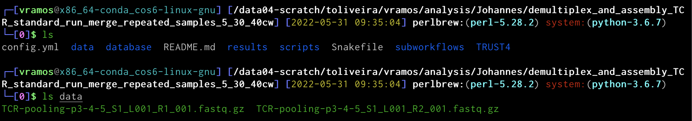
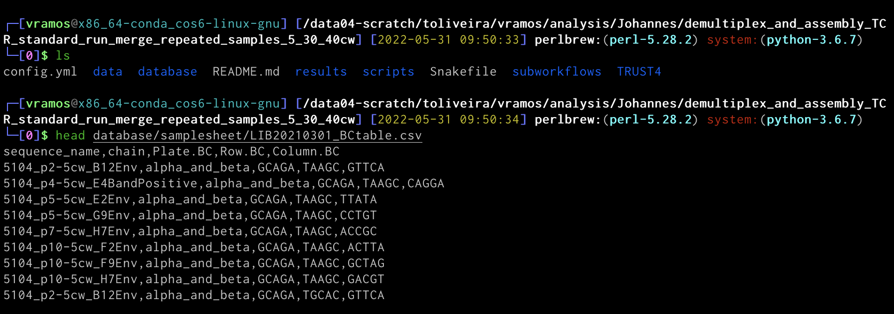

# demultiplex_and_assembly_TCR
This pipeline was designed to demultiplex and assembly reads from PCR-amplified TCR sequences of multiple samples based on the protocol described in [Han, A., Glanville, J., Hansmann, L. et al. Linking T-cell receptor sequence to functional phenotype at the single-cell level. Nat Biotechnol 32, 684–692 (2014)](https://doi.org/10.1038/nbt.2938)  

We used this pipeline to identify CD4+ T cells harboring latent HIV-1 proviral clones reported in [Weymar, Georg et al. Distinct gene expression by expanded clones of quiescent memory CD4+ T cells harboring intact latent HIV-1 proviruses (2022) bioRxiv](https://www.biorxiv.org/content/10.1101/2022.03.02.482683v2.full)

## Execution

(1)
In the main directory, create a folder named 'data' where the FASTQs for individual runs will be placed.



(2)
In the database directory, create a folder named 'samplesheet' and transfer the correspondent csv file of the library to this folder. The CSV file contains the barcodes used to uniquely identify the samples by plate, row and column.

CSV and FASTQ files for each library available in [this link](https://www.dropbox.com/sh/uevlf7fp1jy1nld/AAB5owQqgJAVIly1VnGl6Q2Ma?dl=0).



(3)
Clone [TRUST4](https://github.com/liulab-dfci/TRUST4) to the main directory

(4)
Execute Snakemake with singularity and conda:

```
snakemake -j <number_of_cores> --use-conda --use-singularity
``` 

Add additional arguments to singularity if necessary:

```
snakemake -j <number_of_cores> --use-conda --use-singularity --singularity-args "-B /data04-scratch:/data04-scratch"
```


======

An RMarkdown report was created for custom analysis. File paths are hardcoded, code adaptations is necessary.

File available in [GitHub Gist](https://gist.github.com/victor-ramos/55d72221e31d0bbee9861ba67c2c488a)
